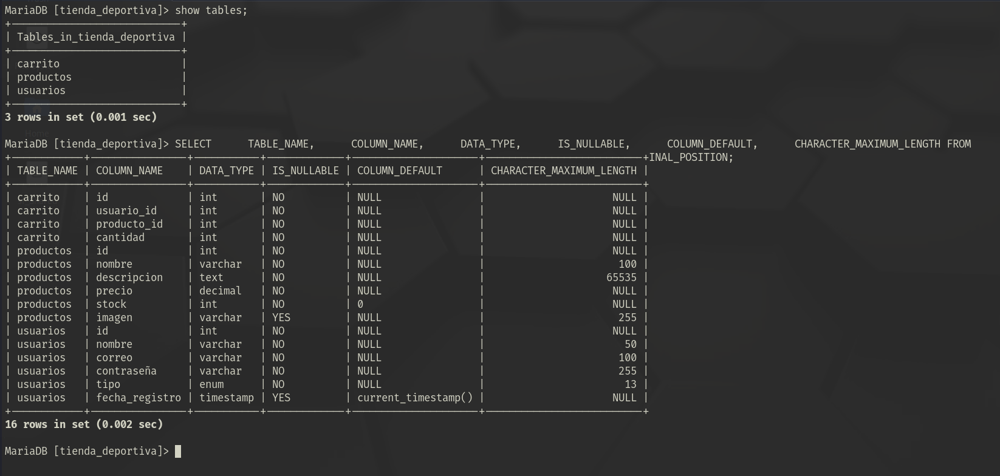

# Sandra-Trainers
El presente proyecto consiste en el desarrollo de una página web para una tienda ficticia de zapatillas deportivas (Sandra-Trainers), diseñada utilizando una arquitectura de tres capas:
1.	Capa cliente: Implementada con HTML, CSS y JavaScript, permite a los usuarios interactuar con la interfaz gráfica de la aplicación. Aquí se encuentran los formularios de registro, login, carrito de compras y gestión de productos.
2.	Capa de lógica de negocio: Desarrollada con PHP, se encarga de procesar las solicitudes del usuario, aplicar la lógica empresarial y comunicarse con la base de datos. Esta capa gestiona funciones como agregar productos al carrito, registrar usuarios, y realizar las operaciones de CRUD (crear, leer, actualizar y eliminar) sobre productos y usuarios.
3.	Capa de acceso a datos: Utiliza PHP y MySQL para interactuar con la base de datos. Aquí se almacenan y gestionan los datos de usuarios, productos y transacciones realizadas.

Schema de las diversas tablas eutilizadas en la BBDD 'tienda_deportiva'

# Videos Objetivos:
- [RF01: Crear, modificar o eliminar usuarios de clientes y tipo administrador (Usuario Administrador)](https://mega.nz/file/EMFgVB4Y#SiIE1b9mh6LN0qJ0ye5JHIXnymml80dpSW6cx2onLQM)
- [RF02: Crear, modificar o eliminar ítems/artículos de la tienda (Usuario Administrador)](https://mega.nz/file/4RlhFRzL#CodwRxZmhLhCdjSQwMxvIIAWoYX0beQOKshxOQatnYk)
- [Rf03: Permitir la navegación y visita de artículos permitiendo agregar al carrito de compras los artículos y confirmar la compra (Usuario Cliente)](https://mega.nz/file/gQlSGBBZ#NcIeekOAWjpKnueDiu4WUz4Gxi2GYUEl5vB06qHhEXg)
